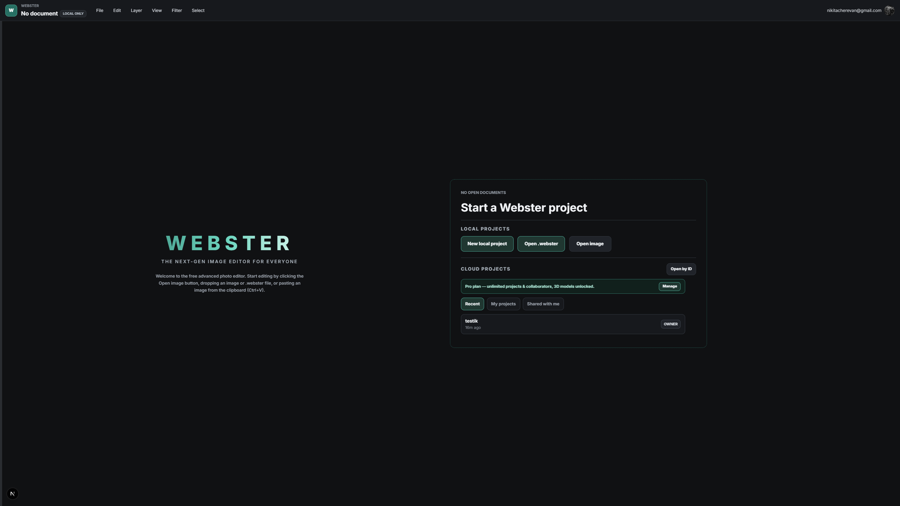
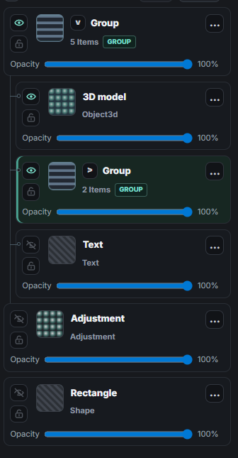
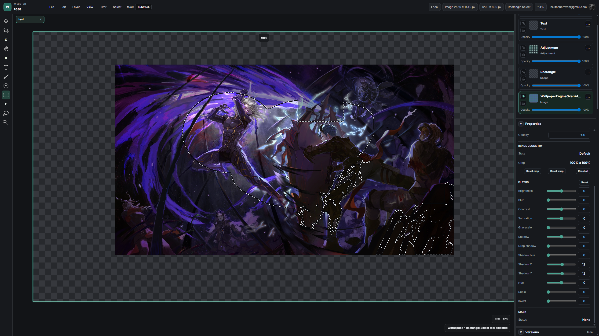
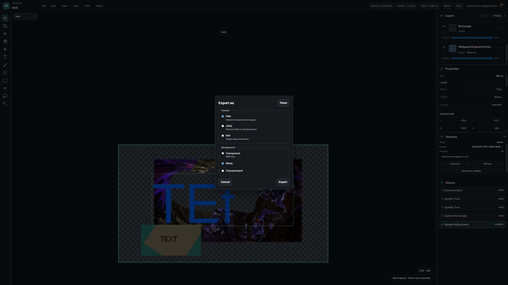
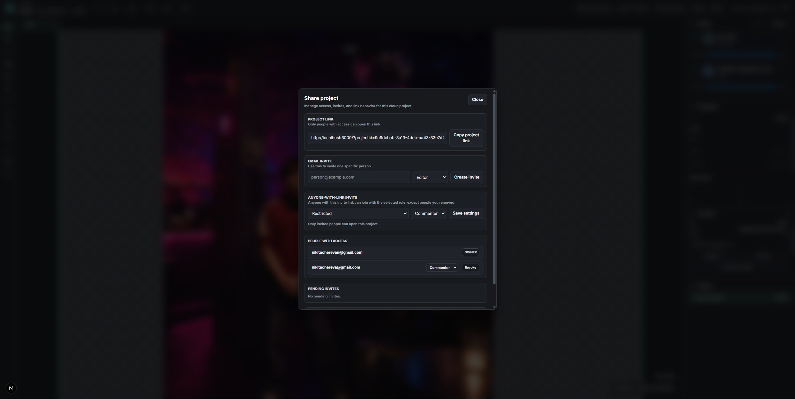

# Webster

Webster is a browser-based image editor for creating, editing, and exporting layered visual projects. It is built for everyday design work: opening images, composing layers, drawing, masking, adding text and shapes, applying filters, and saving editable `.webster` project files.



## Highlights

- Create blank projects from common presets or custom canvas sizes.
- Open images directly from disk, drag and drop files, or paste images from the clipboard.
- Save and reopen editable `.webster` projects.
- Export finished artwork as PNG, JPEG, or PDF.
- Work with multiple project tabs in one editor session.
- Build reusable project templates and start new projects from saved templates.

## Editing Features

Webster supports the core tools expected from a modern layered editor:

- Image, text, shape, stroke, adjustment, and 3D object layers.
- Move, resize, rotate, crop, and transform controls.
- Layer groups, ordering, visibility, locking, opacity, and history.
- Rectangle, ellipse, lasso, and magic selections.
- Selection copy/paste and selection-to-mask conversion.
- Brush, pencil, pen, marker, highlighter, and eraser drawing modes.
- Layer masks with reveal/hide brush painting.
- Text editing with font import, alignment, sizing, color, bold, and italic controls.
- Shape layers for rectangles, circles, lines, triangles, diamonds, and arrows.
- Per-layer filters such as brightness, contrast, saturation, hue, sepia, invert, blur, and shadows.







## Project Files

`.webster` is Webster's native editable project format. Use it when you want to keep layers, text, masks, filters, imported assets, and project structure editable later.

For sharing final artwork, use:

- PNG for transparent or high-quality raster output.
- JPEG for smaller flattened images.
- PDF for a single-page document export.

## Cloud And Sharing

Webster includes UI for sign-in, shared projects, project sharing, presence, comments, and version history. These features require the app to be connected to compatible backend services. Local editing, `.webster` files, templates, and image/PDF export work in the browser without a server.



## Run Locally

Install dependencies:

```bash
npm install
```

Start the web app:

```bash
npm run dev:web
```

Open:

```text
http://localhost:3000
```

Other useful commands:

```bash
npm run build:web
npm run typecheck
```

## Workspace

```text
webster/
  apps/
    web/        Webster web app
    api/        Backend services
  packages/
    shared/     Shared project and collaboration types
  docs/
    screenshots/  Product screenshots
```

## Notes

- The editor is designed to run locally in the browser.
- File System Access API support varies by browser, so some save/reopen flows may fall back to downloads and file pickers.
- 3D model tools and cloud collaboration depend on the configured app environment and account capabilities.
